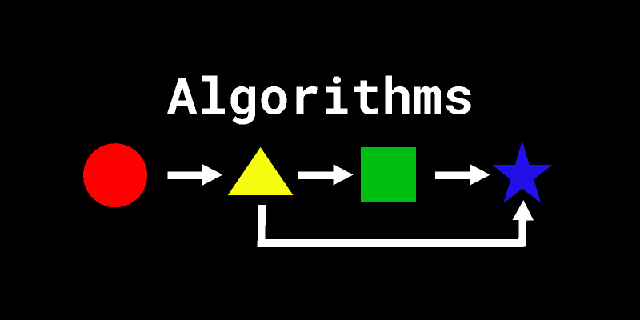

# Solve Algo Problem Using Python


<p align="center">
  
</p>

# Investment Optimization Algorithms: Knapsack Problem

This GitHub repository presents algorithm implementations for solving the classic knapsack problem, applied to financial investment optimization. The challenge is to select the best combination of stocks to purchase in order to maximize profit while adhering to a fixed budget of 500 euros.

## Objective

The goal is to maximize return on investment while adhering to a budget of 500 euros. The challenge is to determine the best combination of stocks to buy to achieve the highest profit possible without exceeding the budget.

## Algorithmic Approaches

To address this problem, we explored two distinct algorithmic approaches:

### Brute Force Algorithm
- **Description:** This algorithm explores all possible combinations of purchases to identify the one that maximizes profit. Although this method guarantees an optimal solution, it is generally impractical for large datasets due to its high computational cost.
- **Disadvantages:** High computation time, impractical for large datasets.

### Dynamic Programming Algorithm
- **Description:** Dynamic programming breaks down the main problem into simpler sub-problems and uses the solutions of these sub-problems to build a global optimal solution. This method is more efficient for handling complex, large-scale problems.
- **Advantages:**
  - Significant reduction in computation time by avoiding unnecessary recalculations.
  - Notable improvement in speed and efficiency compared to brute force.

## Impact

- **Resource Optimization:** Using dynamic programming allows for more effective allocation of financial resources, increasing profits while adhering to budget constraints.
- **Efficiency:** The optimized algorithms demonstrate significant performance improvements, allowing for rapid resolution of complex problems compared to traditional methods.

## Repository Contents

This repository contains the following implementations:
- `bruteforce.py`: Code for the brute force algorithm with demo data.
- `optimized.py`: Code for the dynamic programming algorithm with demo data.
- `optimized_loader`: Modular version of the optimized algorithm designed for use with comprehensive datasets.

You can explore the code files to see the details of each approach and how they are applied to solve the knapsack problem.

## Usage

To use the code, follow these steps:

1. **Clone the Repository:**
   ```
   git clone https://github.com/hericlibong/Solve_algorithme_problems
   ```

2. **Create the virtual env and goes to the folder :**

    ```
    python -m venv env
    source env/bin/activate  # On Windows, use `env\Scripts\activate`
    cd Solve_algorithme_problems
    ```
3. **Install the dependencies**

    ```
    pip install -r requirements.txt

    ```

The Demo versions are in `livrables` folder

Modular version is in `optimized_loader`. 

`data` folder contains 2 datasets real sample.

**Use Case** : 

```
optimized_loader/main.py
```


